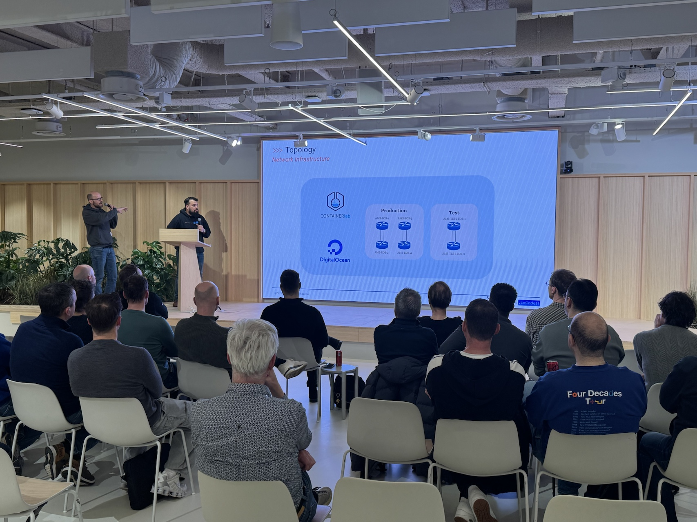
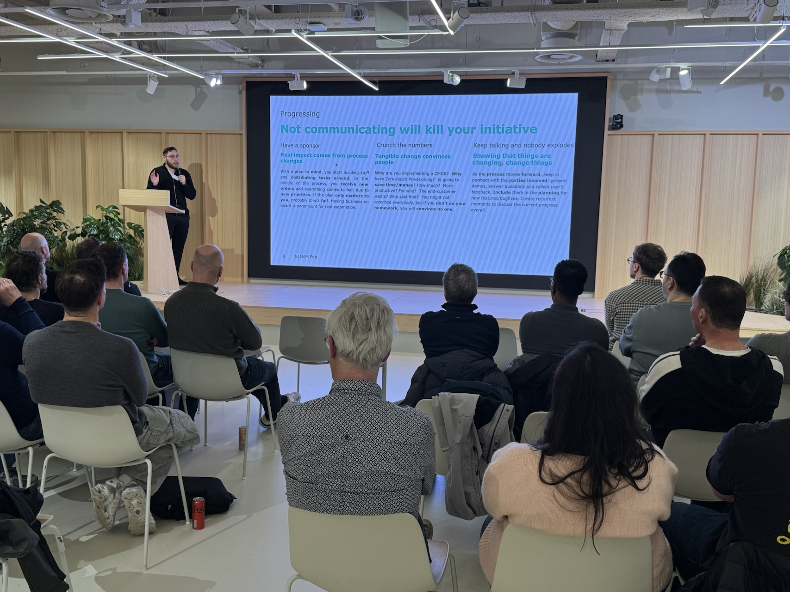

# 📅 Upcoming Events

Join us for our upcoming network automation meetups! Each event features interesting talks and networking opportunities.

{{ generate_upcoming_event_tiles(4) }}

---

## 🎯 Want to host an event?

We are always looking for companies and organizations to host our meetups. If you're interested in hosting or sponsoring, please [contact us](/contact/) or via LinkedIn [Bart Dorlandt](https://www.linkedin.com/in/bartdorlandt/) or [Dan Peachey](https://www.linkedin.com/in/dpeachey/).

### What we'll bring
- Speakers with expertise in network automation
- Marketing and promotion
- A passionate community of network automation professionals

### What You Get
- Brand exposure to a community of network automation professionals
- Opportunity to showcase your company culture
- Direct networking with potential talent and partners
- Community goodwill and industry recognition

---

## 📸 A glimpse

  
  

---

## 📅 Previous Events

Have a look at our [previous events](previous_events.md).