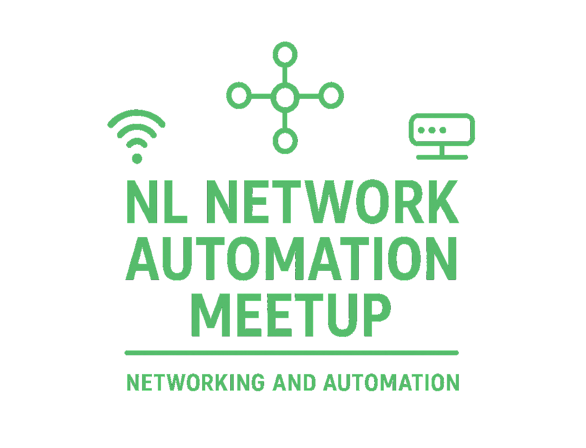

# 🌐 Welcome to NL Network Automation Meetup

  <h2 style="margin-top: 0;">Connecting Network Automation Professionals in the Netherlands</h2>
  

    

      
The Netherlands Network Automation Meetup (NLNAM) is a vibrant community of network engineers, DevOps practitioners, automation enthusiasts and software developers who are passionate about modernizing network infrastructure through code.

      

        <a href="/events/" class="cta-button">📅 Upcoming Events</a>
        <a href="https://www.linkedin.com/groups/15393055/" target="_blank" class="cta-button" style="margin-left: 1rem;">🤝 Join Us on LinkedIn</a>
      

    

    
  

## 🎯 What We Do

!!! automation "Network Automation Focus"
    We organize regular meetups featuring expert talks, hands-on workshops, and networking opportunities for professionals working with, but not limited to:

    - **Infrastructure as Code**
    - **Source of Truth (SoT)**
    - **Configuration Management**
    - **Network Programming**
    - **Monitoring & Observability**
    - **Cloud Networking**
    - **Discoverability & Analytics**
    - **Validation & Testing**
    - **Workflow Automation**
    - **And more...**

## 🏢 Locations & Sponsors

<h3>🤝 Looking for Hosts & Sponsors</h3>

We are actively seeking companies and organizations to host our upcoming meetups. As a host or sponsor, you'll:

  <ul>
    <li><b>Connect</b> with 100+ network automation professionals</li>
    <li><b>Showcase</b> your company's expertise and culture</li>
    <li><b>Contribute</b> to the growing Dutch tech community</li>
    <li><b>Network</b> with potential talent and partners</li>
  </ul>

  

    <a href="/contact/" class="cta-button">🚀 Partner With Us</a>
  

## 🌟 Community Highlights

=== "Expert Speakers"

    Our meetups feature industry experts sharing real-world experiences with:

    - Network automation strategies
    - Infrastructure scaling challenges
    - NetDevOps best practices
    - Tool comparisons and recommendations

=== "Hands-on Workshops"

    Interactive sessions where you can:

    - Build automation playbooks
    - Deploy infrastructure with code
    - Practice troubleshooting techniques
    - Collaborate on group projects

=== "Networking"

    Connect with other professionals active in the Dutch network automation scene:

    - Telecom companies
    - Cloud service providers
    - Financial institutions
    - Government agencies
    - Startups and scale-ups

## 📊 Recent Topics

| Topic                              | Speaker                | Technology Stack                                                                    |
| ---------------------------------- | ---------------------- | ----------------------------------------------------------------------------------- |
| **Ansible for Network Automation** | Network Engineer @ ING | Ansible Python      |
| **GitOps for Infrastructure**      | DevOps Lead @ Adyen    | Terraform GitLab CI |
| **Network Observability**          | SRE @ Booking.com      | Prometheus Grafana  |

## 🔗 Stay Connected

Join our community and stay updated on the latest in network automation:

  <a href="https://www.linkedin.com/groups/15393055/" target="_blank" class="cta-button">💼 LinkedIn</a>
  <a href="/blog/" class="cta-button">📝 Blog</a>
  <a href="/feed_rss_created.xml" class="cta-button">📡 RSS Feed</a>

---

  
🚀 Automating the Future of (Dutch) Networking 🇳🇱

